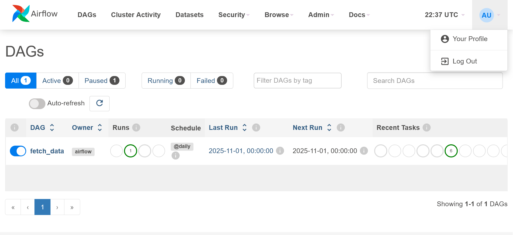

# DataEngineeringProject
This repository contains group 8's project in Data Engineering course held in 2025 autumn

## Project Structure

DataEngineeringProject/
├── compose.yml
├── Dockerfile
├── dags/
│   └── dag_one.py
├── dbt/
│   ├── dbt_project.yml
│   ├── profiles.yml
│   ├── models/
│   │   ├── staging/
│   │   │   └── schema.yml
│   │   ├── marts/
│   │   │   └── schema.yml
│   │   └── bronze/
│   │       └── schema.yml
│   └── seeds/
│       └── seed_config.yml
└── sql/
    ├── 01_create_tables.sql
    └── 02_load_queries.sql

## How to Run

```
docker-compose up -d
```


If the Airflow doesn't initialize, try before docker compose:
```
docker compose run --rm airflow-init
```

Access Airflow at:  
[http://localhost:8080](http://localhost:8080)

Username: airflow
Password: airflow

If the Dag isn't automatically on, please turn it active.



Access Clickhouse at:
[http://localhost:8123/](http://localhost:8123/)
